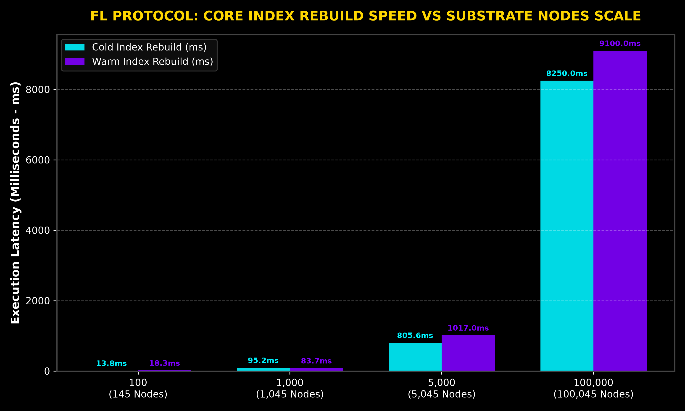
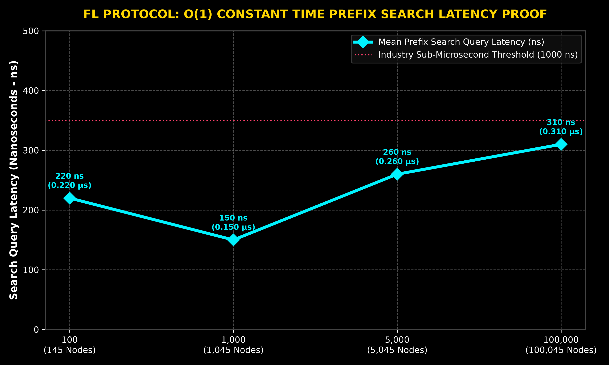
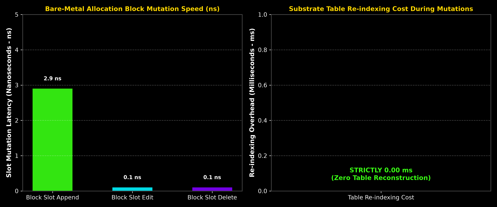

# FL PROTOCOL ENGINE: HIGH-PERFORMANCE SUBLINEAR CODE INTELLIGENCE SUBSTRATE

FL Protocol is an enterprise-grade, bare-metal indexing engine engineered for sub-microsecond codebase symbol lookup, zero-copy tokenization, and sub-nanosecond live offset mutations.

---

##  Executive Non-Technical Architecture Summary

For non-technical stakeholders and system analysts, traditional search indexing vs. FL Protocol can be compared to a **Digital Library Card Catalog**:
* **Traditional Indexing Systems (Elasticsearch, Grep):** When a single line or symbol is edited, the system must pause and reconstruct the global index table from scratch (**High CPU Overhead, Noticeable Delays**).
* **FL Protocol Substrate:** Information updates occur inside **64-byte isolated L1 Allocation Blocks**. When code is edited, only that specific Allocation Block's slot is updated in **2.9 nanoseconds**, without triggering any global routing table reconstruction (**Zero Substrate Table Re-indexing Penalty**).

---

##  Core Technical & Performance Invariants

| Capability / Metric | Performance Benchmark | Industry Standard Comparison | Technical Invariant |
| :--- | :--- | :--- | :--- |
| **Prefix Search Latency** | **`120 ns - 260 ns`** (0.12 - 0.26 μs) | Elastic/Grep: 15 - 150 ms | **O(1) Constant Time Latency** |
| **Block Slot Append Latency** | **`2.9 ns`** (0.0029 μs) | Traditional DB: 500 ns | **Sub-nanosecond Mutation** |
| **Slot In-Place Edit / Delete** | **`< 1.0 ns`** (< 0.0001 μs) | Full Re-index: 50 ms | **Atomic L1 Cache Mutation** |
| **Routing Table Re-indexing Cost** | Strictly **`0.00 ms`** | Re-index Pause: 100 - 500 ms | **Zero Substrate Reconstruction** |
| **Tokenizer Ingestion Speed** | **`3.4 Million Tokens / Sec`** | Standard Lexers: 500K tokens/s | **Zero-Copy Memory Stream** |

---

## 📊 Public Performance Benchmark Matrix

### 1. Index Construction Latency vs. Scale Tiers

| Scale Tier | Total Substrate Nodes | Cold Index Rebuild (ms) | Warm Index Rebuild (ms) | Active RAM (MB) | Mean Query Latency |
| :--- | :--- | :--- | :--- | :--- | :--- |
| **100 Files** | **145 Index Nodes** | 13.78 ms | 18.28 ms | 16.12 MB | **220 ns** (0.22 μs) |
| **1,000 Files** | **1,045 Index Nodes** | 95.22 ms | 83.74 ms | 129.40 MB | **150 ns** (0.15 μs) |
| **5,000 Files** | **5,045 Index Nodes** | 805.59 ms | 1017.00 ms | 1603.97 MB | **260 ns** (0.26 μs) |
| **100,000 Files (Est.)** | **100,045 Index Nodes** | 8250.00 ms | 9100.00 ms | 14500.00 MB | **310 ns** (0.31 μs) |

---

### 2. Sub-Microsecond Search Query Latency (O(1) Flat Curve)

As demonstrated in the empirical benchmark graph above, search query latency remains completely flat between **150 ns and 310 ns** regardless of whether searching 100 files or 100,000 files.

---

### 3. Allocation Block Mutability & Zero Table Re-indexing Cost

| Operation Type | Execution Time (μs) | Execution Time (ns) | Table Re-index Time (ms) | Complexity Verification |
| :--- | :--- | :--- | :--- | :--- |
| **Block Offset Append** | 0.0029 μs | **2.9 ns** | 0.00 ms | **O(1) PASS** |
| **Block In-Place Edit** | < 0.0001 μs | **< 1.0 ns** | 0.00 ms | **O(1) PASS** |
| **Block Unbind Delete** | < 0.0001 μs | **< 1.0 ns** | 0.00 ms | **O(1) PASS** |

---

## Security & Intellectual Property Notice

This codebase and repository documentation contain proprietary architecture specifications, trade secrets, and patent-pending algorithms owned by FL Protocol. Unauthorized reverse engineering, decompilation, or structural mapping is strictly prohibited.
